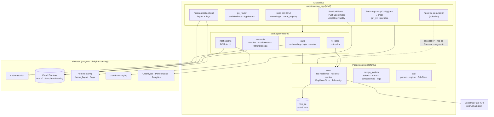

# Componentes

Qué hay en la app, qué servicio usa cada parte y quién la mantiene. Todo lo del diagrama está implementado.

## Responsabilidades

| Componente | Responsabilidad | Piezas principales | Equipo |
|------------|-----------------|--------------------|--------|
| **Shell** | Arranque por flavor, inyección de dependencias y rutas. Compone los features sin que se conozcan entre sí | `bootstrap`, `AppModule`, `createRouter`, `HomePage`, `PersonalizationCubit`, `SessionEffects`, `PushCoordinator`, `AppObservability`, `FirebaseTelemetry` | `@team-platform` |
| **core** | Lo que comparten todos | `createDioClient` con `RetryInterceptor` y `ChaosInterceptor`; `Failure` tipadas; `formatUsd`; `KeyValueStore` (hive_ce); interfaz `Telemetry` | `@team-platform` |
| **design_system** | Identidad visual accesible | Tokens, temas claro y oscuro, `AppButton`, `AppCard`, estados de pantalla, `NexoLogo` | `@team-design-system` |
| **sdui** | Motor de Server-Driven UI | `parseSduiLayout`, `resolveSduiLayout`, `SduiRegistry`, `SduiView`; componentes estándar `promo_banner` y `quick_actions` | `@team-sdui` |
| **auth** | Onboarding, registro, login, recuperar contraseña y sesión | `FirebaseAuthRepository`, `SessionCubit`, `SignInCubit`, `SignUpCubit`, `OnboardingPage`, `AuthPage` | `@team-auth` |
| **accounts** | Cuentas, movimientos paginados, transferencias idempotentes y apertura desde la plantilla | `FirestoreAccountsRepository`, `TransferBetweenOwnAccounts`, `OpeningTemplate`, páginas y cubits; componentes SDUI `balance_card` y `tx_list` | `@team-accounts` |
| **notifications** | Permiso, token y mensajes de FCM, sin UI | `FirebasePushService`, `FirestorePushTokenRegistry` | `@team-notifications` |
| **fx_rates** | Micro app de divisas con una API pública real | `ExchangeRateApiRepository` (caché stale-while-revalidate), `FxPage`; componente SDUI `fx_widget` | `@team-fx` |

## Servicios externos

| Servicio | Para qué | Si falla |
|----------|----------|----------|
| Firebase Authentication | Registro, login y sesión persistente | Login con error tipado ("Sin conexión", "Correo o contraseña incorrectos") |
| Cloud Firestore | Perfiles, cuentas, movimientos, tokens de push y plantilla de apertura | Persistencia offline: se ven los últimos datos con un aviso; las transferencias piden conexión |
| Remote Config | Layout de la home por segmento y feature flags, en tiempo real | Últimos valores activados o los embebidos en la app |
| Cloud Messaging | Notificaciones push (Android) | La app funciona igual, sin push |
| Crashlytics, Performance y Analytics | Monitoreo en producción, sin datos personales | Nunca rompe la app: los fallos al reportar se ignoran |
| ExchangeRate-API | Tasas de cambio reales, sin clave | Reintentos y caché local con "Actualizado hace X" |

Detalle por tema: [resiliencia](../resilience.md), [operación](../deployment-operations.md) y [ADRs](../adr/README.md).
