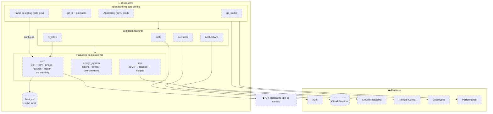

# Componentes

| Componente | Responsabilidad | Equipo dueño |
|------------|-----------------|--------------|
| Shell | Composición, routing, DI global, flavors | `@team-platform` |
| core | Red resiliente, errores tipados, logger, conectividad, caché | `@team-platform` |
| design_system | Tokens, temas claro/oscuro, componentes accesibles | `@team-design-system` |
| sdui | Motor Server-Driven UI | `@team-sdui` |
| auth | Onboarding, registro, login | `@team-auth` |
| accounts | Cuentas, saldos, movimientos, transferencias | `@team-accounts` |
| notifications | Notificaciones push (FCM) | `@team-notifications` |
| fx_rates | Micro app de tipo de cambio | `@team-fx` |
