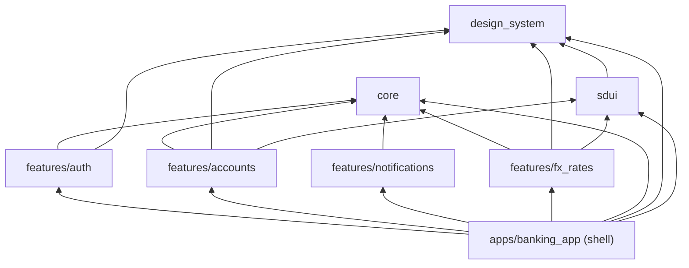
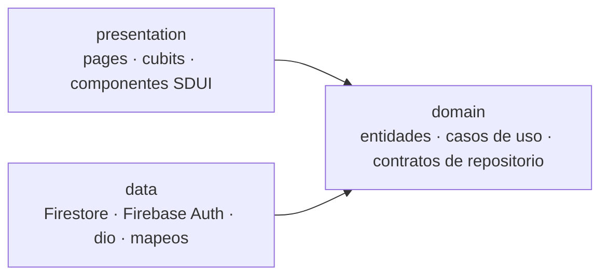

# Dependencias entre paquetes

Por qué un monorepo modular: [ADR-001](../adr/ADR-001-monorepo-modular.md). El grafo sale de los `pubspec.yaml`, y un
test lo verifica en cada PR (ver [Reglas](#reglas)). Cada paquete declara solo lo que importa, así que el grafo muestra
las dependencias reales.

| Paquete | Dependencias externas principales |
|---------|-----------------------------------|
| core | `dio`, `hive_ce`, `equatable`, `intl` |
| design_system | Ninguna: solo Flutter (Inter va empaquetada, sin descargas) |
| sdui | `fpdart`, `equatable` |
| auth | `firebase_auth`, `flutter_bloc` |
| accounts | `cloud_firestore`, `flutter_bloc` |
| notifications | `firebase_messaging`, `cloud_firestore` |
| fx_rates | `dio` (con el cliente resiliente de `core`), `flutter_bloc` |
| shell | `firebase_core`, `firebase_remote_config`, Crashlytics, Performance y Analytics, `get_it` + `injectable`, `go_router` |

## Reglas

1. **Los features no dependen entre sí.** Lo que cruza features lo compone el shell (tabla de abajo).
2. **`core` y `design_system` no dependen de ningún paquete interno.**
3. **`sdui` solo puede conocer `core` y `design_system`** (hoy usa solo `design_system`). Cada feature exporta sus
   componentes SDUI y el shell los registra.
4. **Solo el shell conoce todos los paquetes:** es el único lugar donde se arman las rutas, la inyección de
   dependencias y el registro SDUI.

**Cómo se verifican.** `apps/banking_app/test/architecture/dependency_rules_test.dart` lee el `pubspec.yaml` de cada
miembro del workspace (incluidas las `dev_dependencies`) y falla si un paquete declara un paquete interno que su regla
no permite, o si aparece un paquete sin regla. Corre con `make test` en cada PR. Importar un paquete sin declararlo lo
marca el análisis (`depend_on_referenced_packages`).

## Qué compone el shell

Cada caso necesita dos features. Ninguno importa al otro: el shell los conecta.

| Necesidad | Pieza del shell | Conecta |
|-----------|-----------------|---------|
| Abrir las cuentas al iniciar sesión | `SessionEffects` | `auth` (sesión) → `accounts` (`ensureOpeningData`) |
| Token de push por usuario y abrir la ruta de una notificación | `PushCoordinator` | `auth` → `notifications`, y las rutas del shell |
| Home por segmento | `PersonalizationCubit` | `auth` (sesión), `accounts` (segmento) y Remote Config |
| Componentes de la home | `createHomeRegistry` | `sdui` + `accounts` (`balance_card`, `tx_list`) + `fx_rates` (`fx_widget`) |
| Apagar una función | `AppRoutes.isEnabled` y el router | Flags de Remote Config → rutas de `accounts` y `fx_rates` |
| Telemetría | `FirebaseTelemetry`, inyectada | Los features reportan con la interfaz `Telemetry` de `core`, sin conocer Firebase |

## Capas dentro de cada feature

- **El dominio no importa Flutter, Firebase ni dio.** Por ejemplo, `TransferBetweenOwnAccounts.validate` es Dart puro
  y lo usan el formulario y el caso de uso, así la UI y el dominio nunca discrepan.
- **Los repositorios devuelven `Either<Failure, T>`**; las excepciones no salen de `data`.
- **Entidades y estados con `equatable`.** Los estados son clases `sealed`, con `copyWith` escrito a mano (sin
  codegen; ver el log de desvíos de `CLAUDE.md`).
