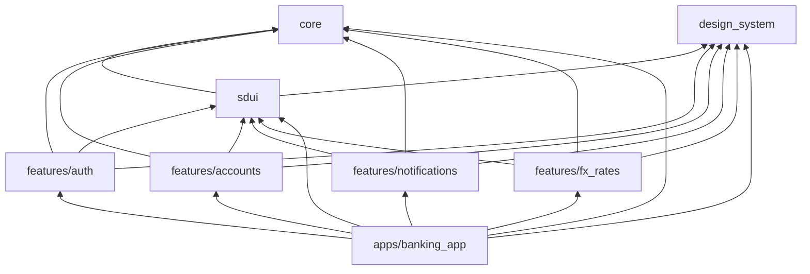
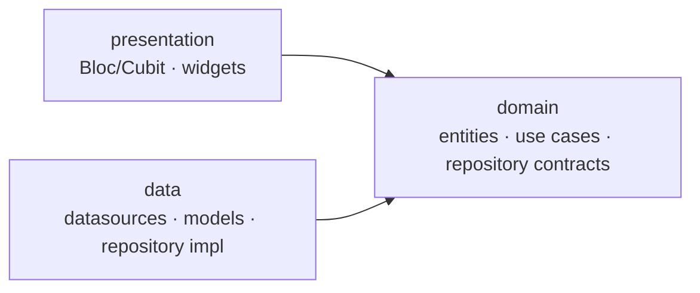

# Dependencias entre paquetes

## Reglas

1. **Los features no dependen entre sí.** Si `accounts` necesita algo de `auth` (p. ej. el usuario actual), el shell inyecta una abstracción definida en `core`.
2. **`core` y `design_system` no dependen de ningún paquete interno.**
3. **`sdui` solo conoce `core` y `design_system`**; los features registran sus propios widgets en el registro SDUI desde el shell.
4. **Solo el shell conoce todos los paquetes.** Es el único lugar donde se componen rutas y módulos de DI.

Las reglas se verifican hoy en revisión de PR (CODEOWNERS). _Planificado: un chequeo automático en CI que falle si un `pubspec.yaml` de un feature declara otro feature._

## Capas dentro de cada feature

