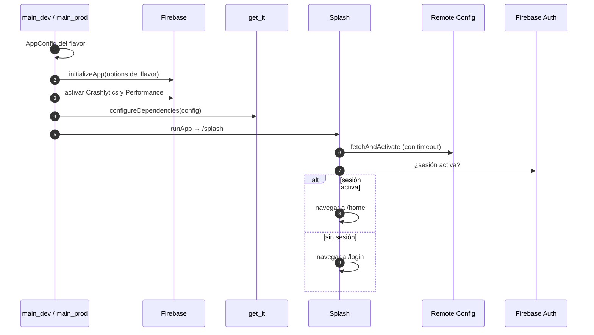
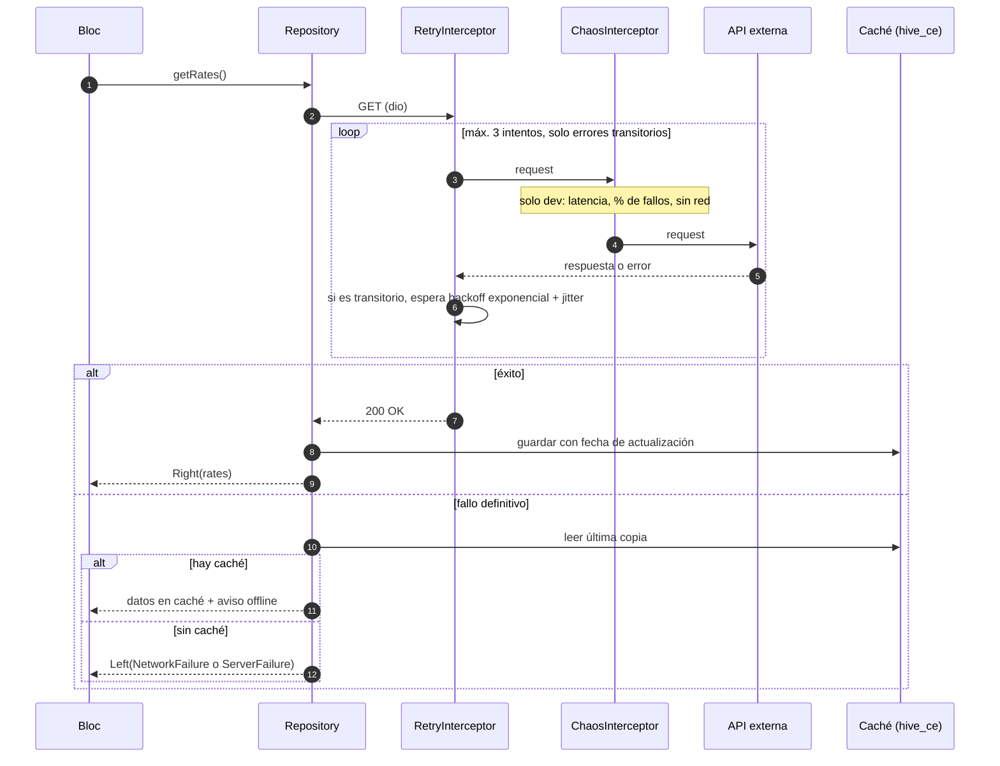
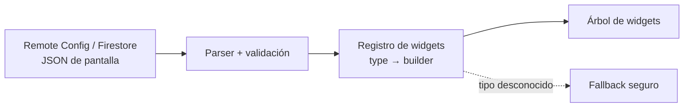

# Flujos clave

> Estado: **planificado**. Los diagramas se actualizan a medida que se implementan los pasos.

## 1. Arranque de la app

## 2. Petición HTTP resiliente

El `RetryInterceptor` se registra antes que el `ChaosInterceptor`: cada reintento vuelve a
pasar por el modo caos, así los fallos inyectados ejercitan la lógica real de reintentos.

## 3. Render Server-Driven UI

