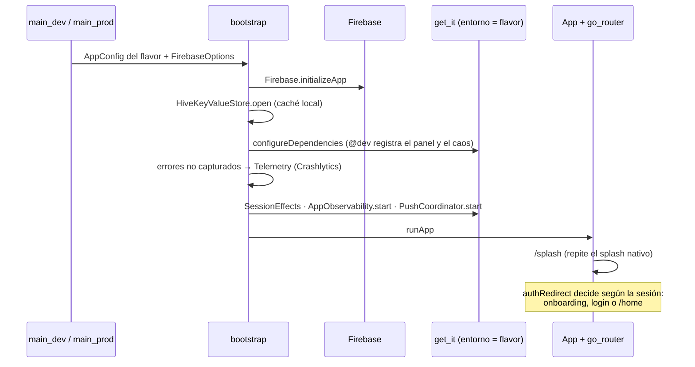
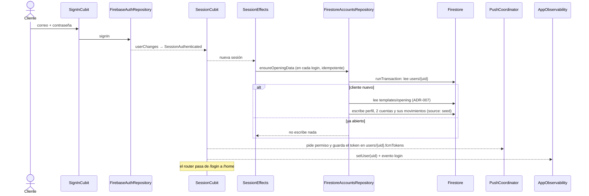
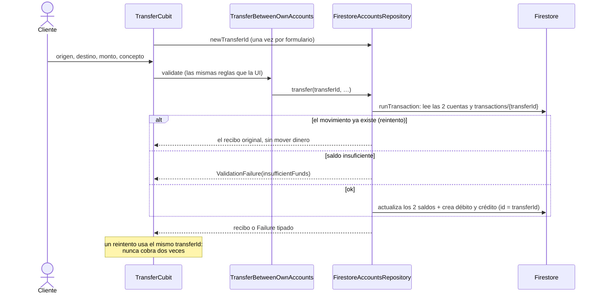
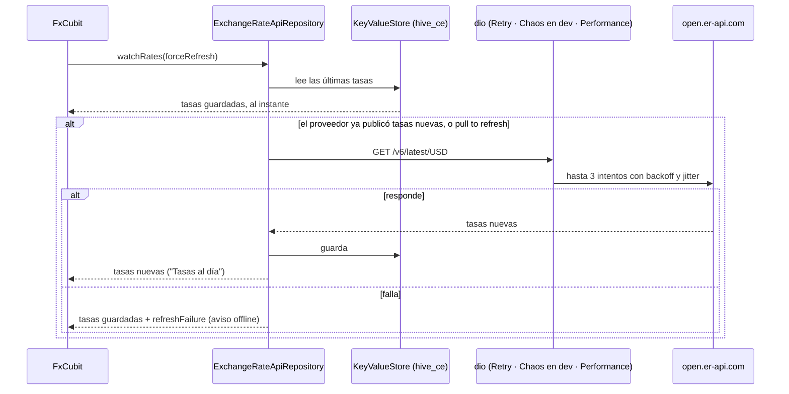
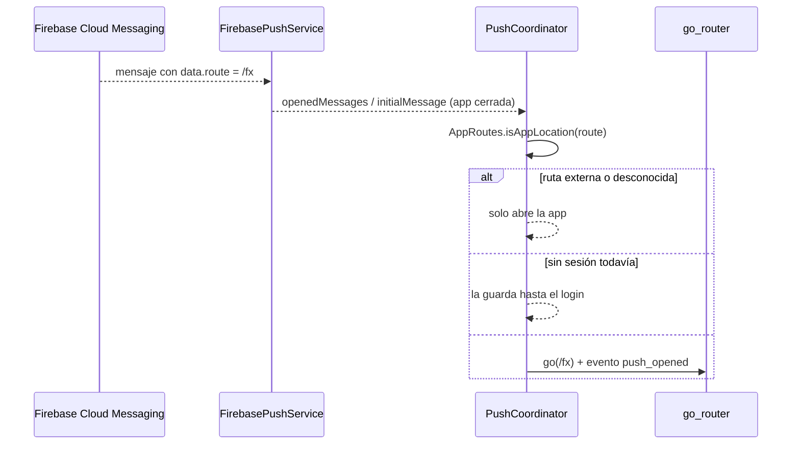

# Flujos clave

Diagramas de secuencia de lo implementado, con los nombres reales de las clases.

1. [Arranque](#1-arranque)
2. [Inicio de sesión y apertura de cuentas](#2-inicio-de-sesión-y-apertura-de-cuentas)
3. [Home personalizada (SDUI + Remote Config)](#3-home-personalizada-sdui--remote-config)
4. [Transferencia idempotente](#4-transferencia-idempotente)
5. [Divisas con caché stale-while-revalidate](#5-divisas-con-caché-stale-while-revalidate)
6. [Tocar una notificación](#6-tocar-una-notificación)

## 1. Arranque



## 2. Inicio de sesión y apertura de cuentas



Si la apertura falla por red, se reintenta en el próximo login. Si la plantilla falta o es inválida, no se escribe nada
y se reporta a Crashlytics.

## 3. Home personalizada (SDUI + Remote Config)

```mermaid
sequenceDiagram
    participant Perso as PersonalizationCubit
    participant FS as Firestore
    participant RC as Remote Config
    participant Home as HomePage
    participant Res as resolveSduiLayout
    participant View as SduiView

    Perso->>FS: escucha users/{uid}.segment
    FS-->>Perso: segment = traveler
    Perso->>RC: setCustomSignals(segment) + fetchAndActivate
    RC-->>Perso: home_layout del segmento + flags
    Perso-->>Home: PersonalizationConfig
    Home->>Res: JSON remoto, layout embebido, registro
    Res-->>Home: remoto si es válido; si no, el embebido (con motivos)
    Home->>View: layout + createHomeRegistry
    View->>View: cada tipo → widget del registro (balance_card, tx_list, fx_widget…)
    Note over View: tipo desconocido: se omite<br/>componente que falla: se aísla y se reporta
    RC-->>Perso: onConfigUpdated (publicación en la consola)
    Perso-->>Home: layout nuevo, sin reiniciar
```

Las acciones de los componentes (`navigate`) solo abren pantallas de la app (`AppRoutes.isAppLocation`) y solo si su
flag está activo (`AppRoutes.isEnabled`).

## 4. Transferencia idempotente



Sin conexión, la transacción falla con `NetworkFailure` y no escribe nada: las transacciones de Firestore no funcionan
offline.

## 5. Divisas con caché stale-while-revalidate



## 6. Tocar una notificación



Con la app abierta, Android no muestra la notificación: `ForegroundPushListener` muestra un aviso con **Ver**, que pasa
por el mismo `open`.
