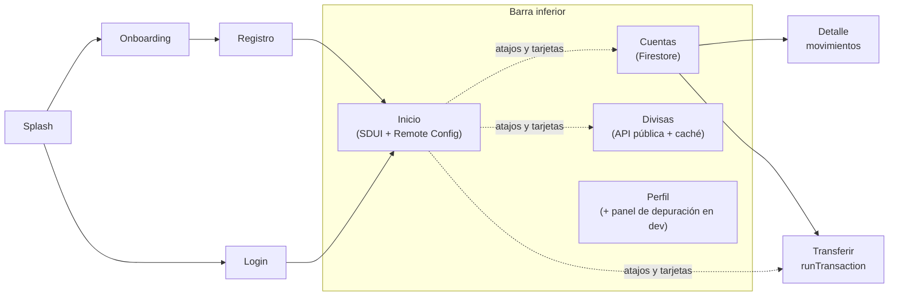

# Guion de demo y escenarios de prueba

Sirve para tres cosas: **entender cómo fluye la app**, **probar cada escenario** antes de grabar y **preparar las
preguntas en vivo** (cambios, diagnóstico de fallas, ajuste de tests).

Cada escenario indica los pasos, el resultado esperado y qué criterio de evaluación demuestra. Recorrerlos todos toma
unos 45 minutos; el video sugerido (sección 3) dura de 10 a 12.

---

## 0. Preparación

1. **Emulador Android con Google Play** (Pixel con imagen "Google Play"). Las notificaciones push necesitan Google
   Play services; iOS no recibe push porque falta la clave APNs (ver `deployment-operations.md` §7).
2. **App en dev:**
   ```bash
   make bootstrap
   make run-dev
   ```
   El flavor dev se llama **"Nexo Dev"**, lleva la cinta DEV y tiene el panel de depuración.
3. **Empezar de cero** (vuelve al onboarding; útil antes de grabar):
   ```bash
   adb shell pm clear com.dennis.banking_app.dev
   ```
4. **Consolas abiertas** en el proyecto `bi-digital-banking` de Firebase:
   - Authentication y Firestore (`users/{uid}`);
   - Remote Config;
   - Messaging;
   - Crashlytics;
   - Analytics → DebugView.
5. **Analytics en tiempo real** (opcional):
   ```bash
   adb shell setprop debug.firebase.analytics.app com.dennis.banking_app.dev
   ```

---

## 1. Cómo fluye la app



- **Sesión:**
  - el router decide a dónde ir según la sesión (`authRedirect`);
  - al iniciar sesión, el shell abre las cuentas (una sola vez por usuario), registra el token de push y fija el
    usuario en la telemetría.
- **Inicio:**
  - el segmento del cliente (`users/{uid}.segment`) viaja a Remote Config como *custom signal*;
  - Remote Config devuelve el `home_layout` de ese segmento;
  - el motor SDUI lo dibuja con los componentes que cada feature registró.
- **Datos reales:**
  - Firebase Auth y Firestore (cuentas, movimientos y transferencias atómicas);
  - Remote Config (layout y flags);
  - ExchangeRate-API (divisas);
  - FCM (push);
  - Crashlytics, Performance y Analytics.

Arquitectura completa: [`docs/architecture`](../architecture/README.md).

---

## 2. Escenarios

### E1 · Onboarding y registro, con apertura de cuentas

1. Con la app recién instalada (paso 0.3), recorre las tres pestañas del onboarding (Banca, Seguridad, Ahorro) con
   **Continuar** y toca **Comenzar**: abre el formulario de registro.
2. Completa nombre, correo (uno nuevo) y contraseña (mínimo 8 caracteres, con letras y números) y toca **Crear
   cuenta**.
3. Acepta el permiso de notificaciones (lo usa E12).

**Resultado:**
- llegas a **Inicio** con "¡Hola, {nombre}!" y el saldo total: **$5,455.29** en 2 cuentas;
- en Firestore aparece `users/{uid}` con `segment: new_user` y `fcmTokens`, más dos cuentas:
  - Cuenta de Ahorros `•••• 4892`: $4,900.29, 24 movimientos;
  - Cuenta Corriente `•••• 1203`: $555.00, 5 movimientos.

**Demuestra:** onboarding y autenticación, datos reales y apertura idempotente: al volver a iniciar sesión no se
duplica nada.

### E2 · Sesión

1. Cierra la app por completo y ábrela: entra directo a Inicio (sesión persistente).
2. **Perfil → Cerrar sesión:** vuelve al login.
3. Prueba una contraseña incorrecta: "Correo o contraseña incorrectos".
4. Escribe tu correo y toca **¿Olvidaste tu contraseña?**: "Te enviamos un enlace…" (llega un correo real de
   Firebase).
5. Inicia sesión de nuevo.

**Demuestra:** sesión persistente, redirect por sesión, errores tipados y mensajes claros.

### E3 · Inicio por Server-Driven UI

Recorre Inicio de arriba a abajo:
- saldo total en la tarjeta navy (tocarla abre Cuentas);
- Operaciones frecuentes;
- la promoción;
- Mercado de divisas (tocarla abre el cotizador);
- Movimientos recientes, de todas las cuentas.

Desliza hacia abajo para recargar.

**Demuestra:** la pantalla viene de un JSON (Remote Config). Cada componente es de un feature distinto, y la
personalización está lista para cambiarse sin publicar.

### E4 · Cuentas y movimientos

1. **Cuentas:** saldo total y una tarjeta por cuenta.
2. Toca **Cuenta de Ahorros:** el detalle muestra cada movimiento con su fecha ("Ayer · 11:41" o la fecha corta; lo
   de hoy dice "Hoy · …").
3. Baja hasta el final: carga de 20 en 20 (scroll infinito) hasta los 24.

**Demuestra:** los 5 estados (carga, datos, vacío, error con reintento y offline), paginación y accesibilidad (cada
movimiento se lee como una frase).

### E5 · Transferencias

1. **Cuentas → Transferir:** de Ahorros a Corriente, toca el chip **$50.00**, escribe un concepto y toca
   **Transferir**.
   **Resultado:** "Transferencia exitosa". En **Ver mis cuentas** cambiaron los dos saldos, y en Inicio el movimiento
   ya aparece en Movimientos recientes, sin recargar.
2. **Reglas:**

   | Prueba | Mensaje |
   |--------|---------|
   | Para = la misma cuenta | "Elige una cuenta distinta a la de origen" |
   | Desde Corriente ($555.00), monto de $1,000 | "Saldo insuficiente en la cuenta de origen" |
   | Monto de $6,000 | "El máximo por transferencia es $5,000.00" |

**Demuestra:** procesamiento real con `runTransaction` (todo o nada), validación compartida entre la UI y el dominio
e **idempotencia**: un reintento nunca cobra dos veces (ver `resilience.md` §2).

### E6 · Personalización por segmento, en vivo

1. **Perfil → Panel de depuración → Segmento del cliente:** elige **traveler** y vuelve a Inicio.
   **Resultado:** en segundos, Mercado de divisas sube al segundo lugar (suma MXN), aparece una promo de viaje
   ("Revisa las tasas del día antes de cambiar") y el atajo destacado es Divisas.
2. Elige **saver:** promo navy "Tu ahorro, siempre a la vista", "Tus últimos movimientos" (8) antes de los atajos y sin
   tarjeta de divisas.
3. Vuelve a **new_user**.

**Demuestra:** el segmento viaja como custom signal, Remote Config elige el layout en el servidor y la app lo aplica
sin reiniciar. También se puede cambiar `segment` directamente en Firestore.

### E7 · Remote Config en vivo desde la consola

Con el segmento `new_user`, en la consola: Remote Config → `home_layout` → **valor predeterminado**.

1. Cambia el `title` de la promo (o el orden de los componentes) y **publica**.
   **Resultado:** la home cambia en segundos, con la app abierta.
2. Agrega un componente que esta versión no conoce, por ejemplo `{"type": "loan_offer", "id": "loan"}`, y publica.
   **Resultado:** se omite y el resto se muestra igual (forward compatibility).
3. Publica un layout que la app no pueda usar, por ejemplo `{"schemaVersion": 2, "components": []}`. La consola no
   deja publicar un JSON mal escrito, así que esta es la forma de probar el fallback.
   **Resultado:** la home muestra el layout embebido en la app; nada se rompe.
4. Revierte: **Historial de cambios → Revertir**, o `make deploy-rc` desde el repo (necesita `firebase login`).

**Demuestra:** cambios sin publicar la app y degradación segura (parser tolerante y fallback). Guía completa en
`deployment-operations.md` §7.

### E8 · Feature flags

1. Publica `feature_transfers_enabled = false`.
   **Resultado:**
   - desaparece **Transferir** en Cuentas;
   - el atajo y la promo de Inicio responden "Esta función no está disponible por ahora.";
   - un deep link a `/accounts/transfer` vuelve a Cuentas.
2. Publica `feature_fx_enabled = false`.
   **Resultado:** la pestaña Divisas explica que no está disponible, la tarjeta desaparece de Inicio y el atajo
   Divisas muestra el mismo aviso.
3. Vuelve a dejar los dos en `true`.

### E9 · Divisas

1. **Divisas:** "Tasas al día", el cotizador con 100 USD → EUR, las tasas de referencia y "Actualizado hace X".
2. Escribe otro monto, cambia la moneda (COP) y toca **⇅** para invertir la conversión.

**Demuestra:** integración con una API externa real, la tasa media sin compra/venta inventada, la atribución del
proveedor y la caché stale-while-revalidate (ADR-006).

### E10 · Modo caos HTTP y recuperación

En **Perfil → Panel de depuración → Red HTTP (modo caos)**, activa el modo caos y luego, en **Divisas**, desliza
hacia abajo para forzar la consulta:

| Configuración | Qué se ve |
|---------------|-----------|
| Latencia de 3000 ms | Las tasas guardadas siguen en pantalla mientras espera ("Actualizando…") |
| Fallos al 50 % | Los reintentos absorben la mayoría: la consulta falla solo si fallan los 3 intentos (1 de cada 8 veces). Los reintentos se ven en los logs |
| Fallos al 100 % | Tras los 3 intentos: "No pudimos actualizar · mostrando las últimas tasas guardadas" |
| Sin red (HTTP) | "Sin conexión · mostrando las últimas tasas guardadas" |
| Apagar el caos y deslizar | Vuelve "Tasas al día" |

**Demuestra:** reintentos con backoff, caché y recuperación; los fallos inyectados pasan por el mismo camino que un
error real.

### E11 · Firestore sin conexión y modo avión

1. En el panel, apaga **Firestore conectado**.
   **Resultado:**
   - Cuentas muestra los datos guardados con "Sin conexión · mostrando tus últimos datos guardados", y la tarjeta de
     saldo de Inicio agrega el mismo aviso;
   - Transferir responde "Sin conexión. Las transferencias necesitan internet; inténtalo de nuevo." sin escribir nada
     a medias.
2. Vuelve a encenderlo: los datos se sincronizan solos y los avisos desaparecen.
3. Repite con el **modo avión** del emulador; Remote Config usa sus últimos valores activos.

### E12 · Notificaciones push

1. En el panel → **Notificaciones push**, toca **Copiar token**.
2. Consola → Messaging → Nueva campaña → Notificaciones → título y texto → **Enviar mensaje de prueba** con el
   token. En **Opciones adicionales → Datos personalizados** agrega `route` = `/fx`.

| Estado de la app | Qué pasa |
|------------------|----------|
| Abierta | Aviso con el título, el texto y **Ver** (abre Divisas) |
| En segundo plano | Notificación del sistema; al tocarla, abre Divisas |
| Cerrada | Al tocarla, la app abre y va a Divisas después de restaurar la sesión |
| Con `route` = `/login` o una URL externa | Solo abre la app: nunca navega fuera de sus pantallas |

### E13 · Observabilidad

1. Panel → **Observabilidad → Enviar error de prueba**: aparece en Crashlytics (proyecto dev) en minutos.
2. **Forzar cierre de la app (crash):** la app se cierra; el crash aparece en Crashlytics al volver a abrirla.
3. Con DebugView activo (paso 0.5), navega y transfiere: se ven `screen_view` (con patrones de ruta, sin ids),
   `transfer_completed`, `home_layout`, etc.

**Demuestra:** monitoreo en producción sin datos personales, con los SLOs y alertas propuestos en
`deployment-operations.md` §6.

### E14 · Accesibilidad, temas e idioma

1. Ajustes del emulador → tamaño de fuente al máximo: los textos crecen sin cortarse; los atajos de Inicio pasan a
   dos columnas.
2. Tema oscuro del sistema: la app cambia de tema, con contraste AA verificado por tests.
3. Idioma del sistema en inglés: textos, nombres de monedas y layouts remotos en inglés.
4. TalkBack: tarjetas, movimientos y atajos se leen como una frase con su rol.

### E15 · Calidad de ingeniería

```bash
make analyze && make test   # análisis estricto y todos los tests
make coverage               # cobertura combinada en coverage/lcov.info
```

- E2E del flujo crítico contra Firebase dev: `make e2e`, con el emulador abierto (ver README, *Pruebas y cobertura*).
- CI en cada PR con el check obligatorio "Analyze, format and test".
- Historial: commits pequeños con Conventional Commits, un PR por paso y merge por rebase.

---

## 3. Guion del video (10–12 min)

| Min | Bloque | Escenarios |
|-----|--------|------------|
| 0:00 | Presentación: qué es Nexo, arquitectura modular en 30 s (diagrama de dependencias) | — |
| 1:00 | Registro y apertura de cuentas | E1 |
| 2:00 | Inicio por SDUI, cuentas y detalle | E3, E4 |
| 3:30 | Transferencia real e idempotente | E5 |
| 4:30 | Personalización en vivo: segmento y consola de Remote Config | E6, E7 |
| 6:00 | Feature flag de transferencias | E8 |
| 6:30 | Divisas y modo caos con recuperación | E9, E10 |
| 8:00 | Firestore sin conexión | E11 |
| 8:45 | Push en primer y segundo plano | E12 |
| 9:45 | Observabilidad: error de prueba en Crashlytics | E13 |
| 10:30 | Calidad: tests, CI, uso de IA (AI_USAGE) y cierre | E15 |

---

## 4. Preguntas en vivo: dónde tocar

| Te piden… | Dónde y cómo |
|-----------|--------------|
| Cambiar la home sin publicar | Remote Config → `home_layout` (E7). En el repo: `firebase/remote-config/*.json`, `make rc-template` y `make deploy-rc` |
| Agregar un componente a la home | `packages/sdui/README.md` § "Agregar un componente": widget + `fromProps`, registrarlo en `createHomeRegistry` (`apps/banking_app/lib/app/home/home_registry.dart`) y probarlo |
| Apagar una función | Flags en Remote Config (E8); en el código, `AppRoutes.isEnabled` y el router |
| Cambiar el límite de transferencia | `TransferBetweenOwnAccounts.maxAmountCents` (`packages/features/accounts/lib/src/domain/usecases/`) y su test en `test/domain/transfer_between_own_accounts_test.dart` |
| Diagnosticar una transferencia que falla | Analytics `transfer_failed{reason}`, la traza `transfer_submit` en Performance, Crashlytics; en código: `TransferPage` → `TransferCubit` → `TransferBetweenOwnAccounts` → `FirestoreAccountsRepository.transfer` |
| La API de divisas no responde | Caché SWR en `ExchangeRateApiRepository` (E10); el aviso sale de `refreshFailure` |
| Ajustar un test | Cada paquete: `cd packages/<paquete> && flutter test`; los dobles comunes están en `test/helpers` y en `package:core/testing.dart` |
| Ver por qué la home usó el layout embebido | Evento `home_layout{source: fallback}` y los logs `sdui.fallback` |

---

## 5. Si algo no sale

| Síntoma | Causa probable |
|---------|----------------|
| No llega el push | Falta el permiso de notificaciones, el emulador no tiene Google Play, o el token cambió (vuelve a copiarlo) |
| El login dice "Sin conexión" en el emulador de Android, pero la Mac tiene internet | El emulador perdió el DNS: `adb shell ping www.google.com` responde "unknown host". Pasa al cambiar de red o con DNS IPv6 en la Mac. Reinícialo con DNS explícitos: `emulator -avd <nombre> -dns-server 8.8.8.8,1.1.1.1` (el nombre sale de `emulator -list-avds`) |
| En iOS, la consola muestra `apns-token-not-set` | Es lo esperado: sin clave APNs, iOS no recibe push (`deployment-operations.md` §7). La app sigue funcionando |
| Al enviar el error de prueba, la consola imprime el error | Es Crashlytics confirmando el envío: en debug imprime cada error que registra. Llega como no fatal |
| La home no cambia al publicar | Revisa que editaste el valor del segmento correcto (predeterminado para `new_user`) y que la app tiene conexión; desliza hacia abajo |
| Divisas no consulta la red | La caché está al día (el proveedor publica una vez al día): desliza hacia abajo para forzar |
| El panel de depuración no aparece | Estás en el flavor prod; usa `make run-dev` |
| VS Code muestra errores en `build/` | Copias generadas de plugins; borra `build/` de la raíz (`deployment-operations.md` §1) |
